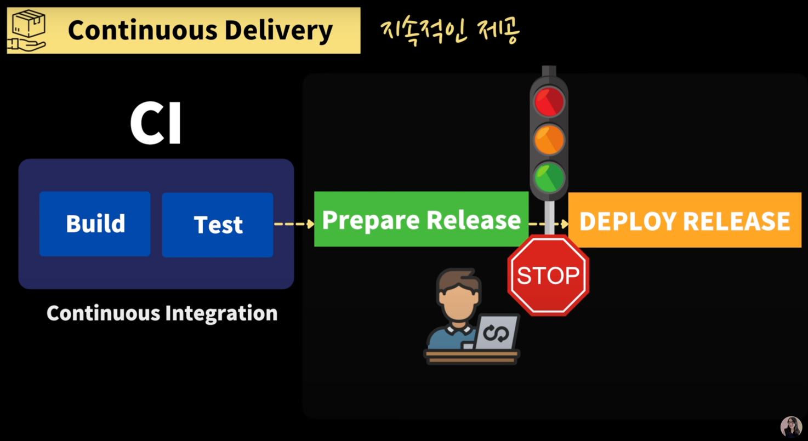
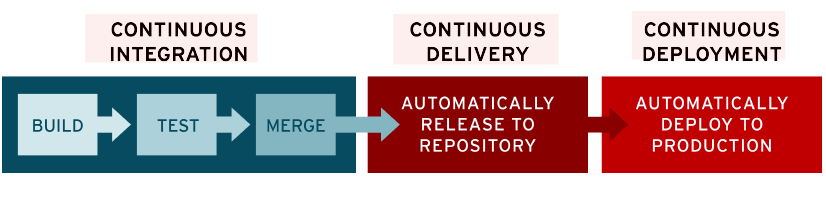

> 해당 포스트는 모모팀 크루 렉스가 작성했습니다.

개발자가 사용자들에게 서비스를 배포하기까지는 개발, 테스트, 빌드, 배포 등의 많은 과정들이 필요하다. 서비스를 한 번만 배포를 하면 이러한 과정을 수행하는 것이 문제가 없지만, 실제 서비스들은 추가적인 기능 개발과 예상하지 못한 오류 수정 등의 많은 코드의 변경이 필요하고 이러한 코드의 변경이 있을 때마다 위의 수많은 과정들을 반복해서 진행해야 할 것이다. CI/CD는 이러한 과정들을 자동화하여 애플리케이션을 짧은 주기로 사용자들에게 제공하고 개발자들이 빌드, 배포와 같은 작업에 투자하는 시간을 단축시켜 개발에 더 많은 시간을 투자할 수 있도록 해준다.

이번 포스트에서는 CI, CD의 개념에 대해 정리하겠다.

# CI (Continuous Integration)

> 간단히 설명하면 빌드, 테스트의 자동화이다.

CI/CD의 "CI"는 개발자를 위한 자동화 프로세스인 지속적인 통합을 의미한다. CI를 성공적으로 구현할 경우 애플리케이션의 코드의 변경사항이 있을 경우 정기적으로 빌드 및 테스트되어 공유 리포지토리에 통합되므로 여러 명의 개발자가 동시에 애플리케이션 개발과 관련된 코드 작업을 할 경우 서로 충돌할 수 있는 문제를 해결할 수 있다.

CI는 두가지 포인트를 잡고 이해하고 개발을 진행하면 좋다.

1. 개발자들은 코드 변경 사항을 주기적으로 빈번하게 머지해야한다는 점이다. 협업을 할 때 여러명의 개발자가 주기적으로 머지를 하지 않고 개발을 큰 단위로 한 후에 머지를 하게 된다면 머지 충돌을 해결하는데 많은 시간을 소모하게 될 것이다. 그렇기에 작업을 작은 단위로 나눠서 개발을 하여야하며 버그를 수정하거나 새로운 기능을 구현한다면 바로 반영을 하여야 한다. 이와 같이 주기적으로 머지를 한다면 머지 충돌을 최소화하여 개발의 생산성이 향상되고 코드의 변경사항이 적어 문제점들을 빠르게 해결할 수 있다는 이점을 얻을 수 있다.
2. CI는 통합을 위한 빌드 단계(빌드, 테스트, 머지)의 자동화를 제공한다는 점이다. CI는 코드 버전을 관리하는 VCS시스템(Git, SVN등)에 Push되면 자동으로 테스트와 빌드가 수행되어 안정적인 배포 파일을 만드는 과정을 제공한다. 개발자는 스크립트를 통해 빌드와 개발자가 작성한 테스트 코드들을 자동으로 실행하게 할 수 있다. 이때 만약 빌드 또는 테스트가 실패하게 된다면 Push된 코드에 오류가 있다고 개발자에게 피드백을 주어 개발자는 오류에 대해 빠르게 대처할 수 있다. 또한 CI 테스트가 개발자들이 작성한 Unit Test, Integration Test 등을 통해 실행되기에 CI를 위한 테스트가 반강제적이게 되어 조금 더 나은 코드 퀄리티를 만들 수 있다.

마틴 파울러는 CI의 4가지 규칙이 있다고 언급하였다. 규칙은 다음과 같다.

1. 모든 소스코드가 살아있고(현재 실행되고) 누구든 현재의 소스에 접근할 수 있는 단일 지점을 유지할 것
2. 빌드 프로세스를 자동화해서 누구든 소스로부터 시스템을 빌드하는 단일 명령어를 사용할 수 있게 할 것
3. **테스팅을 자동화**해서 단일 명령어로 언제든지 세스템에 대한 건전한 테스트 수트를 실행할 수 있게 할 것
4. 누구나 현재 실행 파일을 얻으면 지금까지 가장 완전한 실행 파일을 얻었다는 확신을 하게 할 것

> 프로젝트가 완전한 상태임을 보장하기 위해서는 테스트 코드가 구현되어 있어야만 한다.
>

[Continuous Integration (original version)](https://www.martinfowler.com/articles/originalContinuousIntegration.html)

# CD (Continuous Deployment or Continuous Delivery)

> 간단히 설명하자면 배포의 자동화이다.
>

CI/CD의 "CD"는 지속적인 서비스 제공(Continuous Delivery) 및/또는 지속적인 배포(Continuous Deployment)를 의미하며 이 두 용어는 상호 교환적으로 사용된다. 두 가지 의미 모두 파이프라인의 추가 단계에 대한 자동화를 뜻하지만 때로는 얼마나 많은 자동화가 이루어지고 있는지를 설명하기 위해 별도로 사용되기도 한다.

### 지속적인 제공 (Continuous Delivery)

지속적인 제공은 CI의 작업을 거친 후, 리포지토리에 자동으로 업로드 되는 것을 뜻한다. 개발자나 검증팀은 리포지토리에 업로드된 준비된 Release가 정상적인지 문제가 없는지 이 검증을 한 후, 애플리케이션을 실시간으로 프로덕션 환경에 수동으로 배포할 수 있다. 이는 개발팀과 비즈니스 팀 간에 가시성과 소통 부족의 문제를 해결해준다. 지속적인 제공은 최소한의 노력으로 새로운 코드를 배포하는 것을 목표로 하고 있다.

> 지속적 제공 프로세스를 구축하기 위해서는 개발 파이프라인에 CI를 먼저 구축하여야 한다.
>

### 지속적인 배포 (Continuous Deployment)

Delivery와 다르게 개발자나 검증팀이 준비된 Release를 확인하지 않고 배포까지 자동화 해두는 것을 Continuous Deployment라고 한다. 즉, Delivery와 비슷하지만 최종 단계가 자동화가 되었는지, 안 되었는지에 따라 다르게 부른다.

CI/CD는 지속적 통합 및 지속적 제공(CD, Continuous Delivery)의 구축 사례만을 지칭할 때도 있고, 지속적 통합, 지속적 제공, 지속적 배포라는 3가지 구축 사례 모두를 의미하는 것일 수도 있다. 해당 용어는 사례별로 CI/CD 파이프라인에 구현된 자동화 수준 정도에 따라 그 의미가 달라지게 된다. 회사마다 어느정도로 자동화를 하는지가 다르기 때문에 CI/CD라고 하여서 모든 회사가 똑같은 프로세스를 거치는게 아니고 회사, 팀마다 다른 방식을 적용할 수 있다.

# CI/CD의 대표적인 툴

Jenkins, Buildkite, Github Actions, GitLab CI/CD, Bitbucket Pipelines, Circleci 등이 있다. 이 중에서 가장 많이 사용되는 것은 Jenkins이다.

# Reference
- [스프링 부트와 AWS로 혼자 구현하는 웹 서비스 - 이동욱님](https://book.naver.com/bookdb/book_detail.nhn?bid=15871738)
- [스프링 부트와 AWS로 혼자 구현하는 웹 서비스](https://book.naver.com/bookdb/book_detail.nhn?bid=15871738)
- [CI/CD 5분 개념 정리 (현업에서 쓰는 개발 프로세스)](https://www.youtube.com/watch?v=0Emq5FypiMM&t=296s)
- [CI/CD(지속적 통합/지속적 제공): 개념, 방법, 장점, 구현 과정](https://www.redhat.com/ko/topics/devops/what-is-ci-cd)
