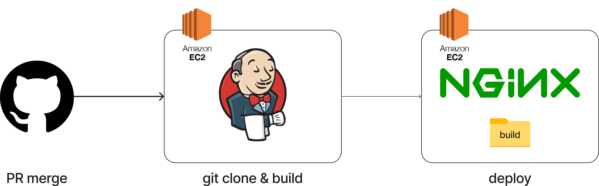
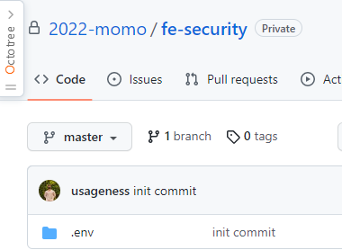
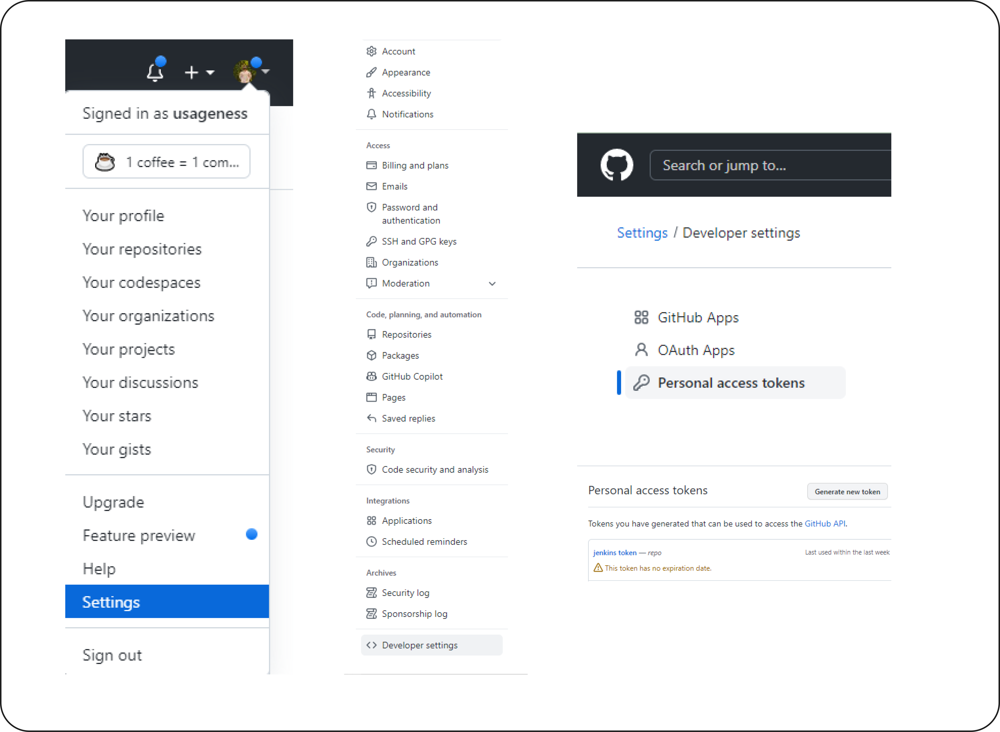
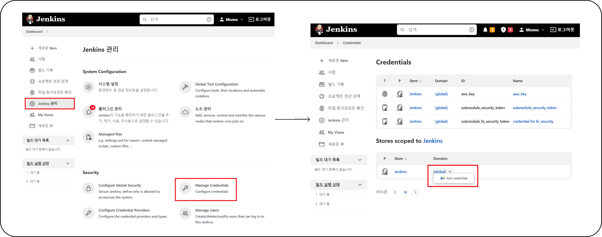
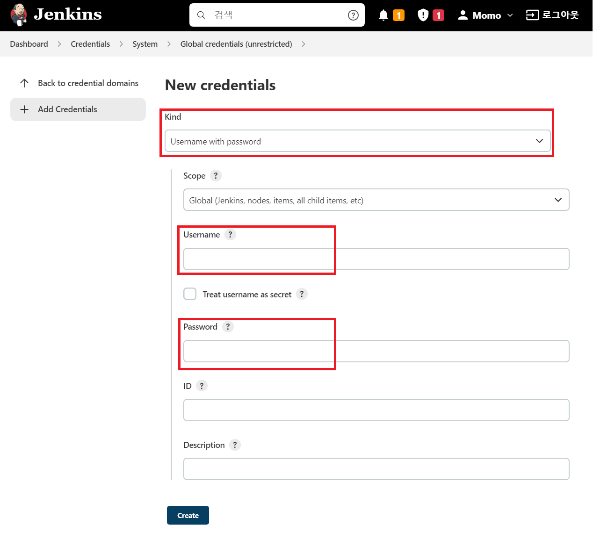

> 해당 포스트는 모모팀 크루 유세지가 작성했습니다.

이번 프로젝트의 릴리즈에서, 환경 변수의 관리 방법을 기존의 로컬 파일에 의존하던 방식에서 github의 `submodule`를 적용하여 관리하는 방법으로 변경하였습니다. 어떤 점에서 불편을 느꼈고, 어떻게 이러한 방식을 적용하게 되었는지 이야기해보려 합니다.

# 환경 변수?

위키백과에 따르면, 환경 변수란 실행 중인 프로세스가 컴퓨터에서 동작하는 방식에 영향을 미치는 동적인 값들의 모임이라고 설명하고 있습니다. 물론 틀린 말은 아니나, 이것은 OS의 관점에서 설명했기에 저희 프로젝트에서 적용한 환경 변수에는 다소 와닿지 않는 설명입니다.

현재 프로젝트 상황에 맞도록 조금 다르게 설명해보면, 환경 변수는 **“프로젝트의 환경에 따라 다르게 사용되는 변수”** 정도로 정의할 수 있을 것 같습니다.

# 환경 변수를 사용하는 이유

환경 변수를 사용하는 이유는 크게 두 가지를 들 수 있습니다.

## 1. 보안을 위해

프로젝트를 진행하다 보면, 외부에 공개하면 문제가 생길 수 있지만 프로젝트에는 꼭 포함되어야 하는 정보들이 있습니다. 가령 API Key 라던가, DB에 접근하는 계정이 그 예시입니다.

이러한 정보들이 프로젝트에 그대로 포함된 채 깃허브의 public repository 같은 공개적인 장소에 올라가게 되면 중요 정보가 외부에 노출되어 자칫 위험한 상황으로 이어질 수 있습니다. 실제로 깃허브에 이러한 key값이 노출되면 종종 보안 경고 메일이 오기도 합니다.

이러한 상황을 미연에 방지하기 위해, 중요 정보들은 별도의 환경 변수로 관리하여야 합니다. 주요 정보를 환경 변수 파일로 설정해주고, 깃허브에 올라가지 않도록 `.gitignore` 파일에 추가해주면 이러한 정보가 새는걸 막을 수 있습니다.

## 2. 개발 환경을 위해

환경 변수는 보안 뿐 아니라 개발 환경이 나뉘어진 경우에도 유용합니다. 모모 프로젝트의 구조를 생각해보겠습니다. 모모는 크게 production mode와 develop mode로 나뉘어져 있습니다. develop mode에서 모킹된 API를 사용하거나, 별도의 개발용 서버를 사용하기 위해서는 두 mode의 BASE URL이 다를 필요가 있습니다.

develop mode와 production mode를 오가며 BASE URL과 이에 따른 설정들을 하나하나 바꿔주는건 번거롭습니다. 그렇다고 코드에 조건문들을 추가하자니 프로덕션 코드가 더러워집니다. 이럴때 환경 변수를 선언해주면 이러한 변경들을 깔끔하게 관리할 수 있습니다.

# 처음에 시도했던 방법

모모에서는 처음엔 환경 변수 파일을 생성하여 로컬 파일로 관리하였습니다. 그러나 Jenkins를 통해 CI/CD를 관리하기 시작하며 로컬에만 존재하는 환경 변수 파일을 함께 배포하기 번거로워졌습니다.

당시의 배포 과정은 이렇습니다.

<center>



</center>

프로젝트의 저장소에서 PR이 merge되면, webhook을 통해 Jenkins가 repository clone을 시도합니다. 클론이 완료되면 node module을 설치하고, build 하여 그 결과물을 Nginx가 설치된 서버에 자동으로 배포합니다.

여기서 문제가 발생합니다. 우리가 만든 환경 변수 파일은 github에 올라가지 않았기에 이 상태로 빌드를 시도하면 오류가 발생할 것입니다. Jenkins 파이프라인의 스크립트를 수정하여 다른 경로에 있는 환경 변수 파일을 참조하도록 하거나, 배포 방식을 수동으로 바꾸는 방법도 있겠지만 이러면 Jenkins를 적용하며 생긴 이점이 상당 부분 사라지거나, 기껏 구성한 환경이 다시 복잡해질 것입니다.

그래서 저희는 조금 더 우아한 방법을 적용해보았습니다.

# submodule 적용 과정

이러한 문제를 해결하기 위한 방법으로, git에서 제공하는 submodule(이하 서브모듈)이 있습니다. 서브모듈이란 기존의 repository에 다른 repository를 넣어주는 형태인데, 기존 파일 구조를 건드리지 않으면서 다른 저장소의 코드를 모듈처럼 독립적으로 관리할 수 있다는 특징이 있습니다. 이렇게 하면 기존의 코드를 최대한 건드리지 않고, 구성해 둔 파이프라인을 깨지 않으며 환경 변수를 적용할 수 있습니다. 지금부터 한 번 적용해보겠습니다.

## 프로젝트에 서브모듈 적용하기

먼저 서브모듈로 사용할 새로운 repository를 만듭니다. 이 저장소에는 환경 변수를 업로드 해주어야 하기 때문에 private으로 생성해줍니다.

<center>



</center>

해당 repository에 환경 변수를 업로드했다면, 이제 메인이 되는 repository로 돌아와서 서브모듈을 불러올 차례입니다. 명령어를 통해 서브모듈을 연결해줍니다.

```Groovy
git submodule add [서브모듈의 주소]
git add *
git commit -m "chore: apply submodule"
git push origin [원하는 브랜치]
```

이렇게 했다면, 이제 기존 repository에는 서브모듈이 적용된 상태입니다.

아래의 명령어를 이용하여 다른 팀원의 프로젝트에서도 서브모듈을 적용해줍니다.

```Groovy
git clone [메인 프로젝트 주소] // 처음 시작 시
git submodule update --init --recursive
```

## Jenkins에 서브모듈 적용하기

Jenkins에서도 서브모듈을 사용할 수 있게 해주려면 몇 가지 설정이 필요합니다. 먼저 Jenkins가 private repository에 접근하여 서브모듈을 받아올 수 있도록 권한을 설정해주어야 합니다.

먼저 github에서 토큰을 발급합니다.

<center>



</center>

[Settings] → [Developer settings] → [Personal access tokens] 메뉴에서 접근 가능한 토큰을 생성하고, 키 값을 복사해둡니다.

이제 이 키를 Jenkins에 등록해서 사용해야 합니다.

Jenkins의 `Dashboard > Manage Credentials` 에서 `Add Credentials`를 누릅니다.

<center>



</center>

키 값을 통해 github에 로그인 하는 방식이므로, Kind의 `Username with password`을 선택하고 나머지 빈 값을 채워줍니다.

<center>



</center>

`Username`에는 Credential의 소유주를 입력해줍니다. 아무렇게나 적어도 상관없지만, 저는 앞서 토큰을 발급했던 계정을 입력해주었습니다.

`Password`엔 앞서 복사했던 발급받은 token을 넣어주시고, ID에는 Jenkins에서 사용될 Credential의 이름을 입력해주시면 됩니다. 이후 Jenkins에서 지금 설정한 ID를 통해 Credential을 사용할 수 있습니다.

`Description`에는 이 Credential에 대한 간단한 설명을 적어주고, Create 버튼을 눌러 생성을 마무리합니다.

이제 생성된 Credential을 통해 파이프라인 코드를 수정하여 서브모듈을 가져오는 과정을 추가할 차례입니다. 기존에 CI/CD를 위해 파이프라인을 작성하셨던 분들이라면 아래와 같은 코드를 이미 사용하고 계실겁니다.

```groovy
stage('Git Clone') {
    steps {
        git branch: 'develop-fe', url: 'https://github.com/woowacourse-teams/2022-momo.git'
    }
}
```

여기에 앞서 생성한 Credential을 활용하여 `git submodule update --init --recursive` 명령어를 실행하는 코드를 덧붙이면 서브모듈을 함께 불러와 적용할 수 있게 됩니다.

```groovy
stage('Git Clone') {
    steps {
        git branch: 'develop-fe', url: 'https://github.com/woowacourse-teams/2022-momo.git'
        withCredentials([GitUsernamePassword(credentialsId: 'submodule_fe_security_token', gitToolName: 'Default')]) {
            sh 'git submodule update --init --recursive'
        }
    }
}
```

이렇게 환경 변수를 외부에 노출하지 않고, 구현된 CI/CD 파이프라인을 해치지 않는 서브모듈 적용이 끝났습니다.
